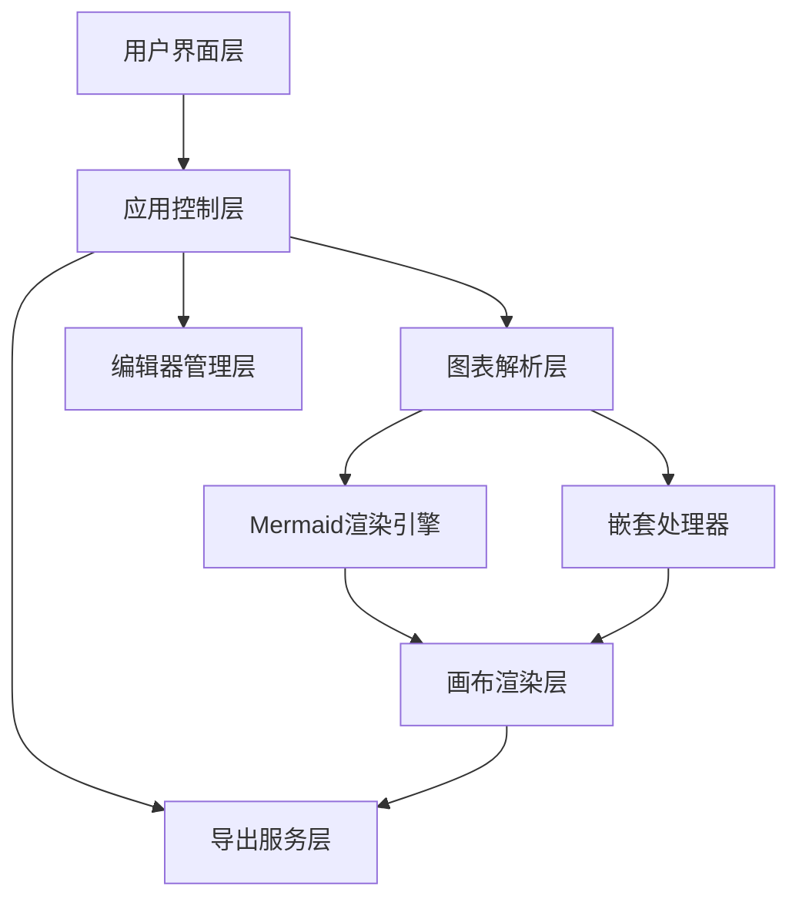

# Design Document

## Overview

Mermaid渲染器是一个基于Web的图表可视化应用程序，采用现代前端技术栈构建。核心创新在于实现了Mermaid图表的嵌套功能，通过自定义语法扩展和渲染引擎，支持在一个图表中嵌入其他类型的子图表。

应用程序采用模块化架构，包含代码编辑器、图表渲染引擎、嵌套处理器和导出模块等核心组件。

## Architecture

### 整体架构



### 技术栈选择

- **前端框架**: React 18 + TypeScript
- **状态管理**: Zustand (轻量级状态管理)
- **代码编辑器**: Monaco Editor (VS Code编辑器核心)
- **图表渲染**: Mermaid.js + 自定义扩展
- **样式框架**: Tailwind CSS
- **构建工具**: Vite
- **测试框架**: Vitest + React Testing Library

## Components and Interfaces

### 1. 主应用组件 (App)

```typescript
interface AppState {
  editorPosition: 'left' | 'right' | 'hidden';
  currentCode: string;
  renderError: string | null;
  isLoading: boolean;
}

interface AppActions {
  setEditorPosition: (position: 'left' | 'right' | 'hidden') => void;
  updateCode: (code: string) => void;
  setRenderError: (error: string | null) => void;
}
```

### 2. 代码编辑器组件 (CodeEditor)

```typescript
interface CodeEditorProps {
  code: string;
  onChange: (code: string) => void;
  onError: (error: string | null) => void;
  position: 'left' | 'right';
}

interface EditorFeatures {
  syntaxHighlighting: boolean;
  autoCompletion: boolean;
  errorDetection: boolean;
  undoRedo: boolean;
}
```

### 3. 图表画布组件 (DiagramCanvas)

```typescript
interface DiagramCanvasProps {
  code: string;
  onRenderComplete: () => void;
  onRenderError: (error: string) => void;
}

interface CanvasState {
  zoomLevel: number;
  panOffset: { x: number; y: number };
  selectedElement: string | null;
}
```

### 4. 嵌套处理器 (NestedDiagramProcessor)

这是核心创新组件，负责解析和处理图表嵌套：

```typescript
interface NestedDiagramProcessor {
  parseNestedSyntax: (code: string) => ParsedDiagram;
  renderNestedDiagram: (diagram: ParsedDiagram) => Promise<RenderedDiagram>;
  handleNestedInteraction: (elementId: string) => void;
}

interface ParsedDiagram {
  type: MermaidDiagramType;
  content: string;
  nestedDiagrams: Map<string, ParsedDiagram>;
  parentReferences: string[];
}

interface NestedSyntaxExtension {
  // 自定义语法: {{diagram:type:id}} 用于标记嵌套图表
  // 例如: A --> {{diagram:sequence:login-flow}}
  nestedMarker: RegExp;
  diagramRegistry: Map<string, string>; // id -> diagram code
}
```

### 5. 导出服务 (ExportService)

```typescript
interface ExportService {
  exportToPNG: (element: HTMLElement, options: ExportOptions) => Promise<Blob>;
  exportToSVG: (element: HTMLElement, options: ExportOptions) => Promise<Blob>;
  exportToPDF: (element: HTMLElement, options: ExportOptions) => Promise<Blob>;
}

interface ExportOptions {
  width?: number;
  height?: number;
  backgroundColor?: string;
  includeNestedDiagrams?: boolean;
}
```

## Data Models

### 图表数据模型

```typescript
// 基础图表类型
type MermaidDiagramType = 
  | 'flowchart' 
  | 'sequence' 
  | 'gantt' 
  | 'class' 
  | 'state' 
  | 'pie' 
  | 'git' 
  | 'er' 
  | 'journey';

// 嵌套图表结构
interface DiagramNode {
  id: string;
  type: MermaidDiagramType;
  code: string;
  position: { x: number; y: number };
  size: { width: number; height: number };
  children: DiagramNode[];
  parent?: string;
}

// 应用状态模型
interface ApplicationState {
  // 编辑器状态
  editor: {
    position: 'left' | 'right' | 'hidden';
    code: string;
    cursorPosition: number;
    history: string[];
    historyIndex: number;
  };
  
  // 画布状态
  canvas: {
    zoomLevel: number;
    panOffset: { x: number; y: number };
    selectedElements: string[];
    renderError: string | null;
  };
  
  // 图表数据
  diagram: {
    rootNode: DiagramNode;
    flattenedNodes: Map<string, DiagramNode>;
    renderCache: Map<string, RenderedElement>;
  };
}
```

### 嵌套语法设计

为了实现图表嵌套，我们设计了一套扩展语法：

```
// 基础嵌套语法
{{diagram:type:id}}

// 示例用法
flowchart TD
    A[开始] --> B{用户登录}
    B -->|成功| C[显示仪表板]
    B -->|失败| D[{{diagram:sequence:login-sequence}}]
    C --> E[结束]

// 定义嵌套的序列图
---diagram:sequence:login-sequence---
sequenceDiagram
    participant U as 用户
    participant S as 系统
    U->>S: 输入凭据
    S->>S: 验证凭据
    S-->>U: 返回错误信息
---end---
```

## Error Handling

### 错误类型定义

```typescript
enum ErrorType {
  SYNTAX_ERROR = 'syntax_error',
  RENDER_ERROR = 'render_error',
  NESTED_ERROR = 'nested_error',
  EXPORT_ERROR = 'export_error',
  NETWORK_ERROR = 'network_error'
}

interface DiagramError {
  type: ErrorType;
  message: string;
  line?: number;
  column?: number;
  diagramId?: string;
  stack?: string;
}
```

### 错误处理策略

1. **语法错误处理**
   - 实时语法检查，在编辑器中高亮错误位置
   - 提供详细的错误信息和修复建议
   - 支持部分渲染，即使存在语法错误也尽可能显示正确部分

2. **嵌套图表错误处理**
   - 循环引用检测：使用深度优先搜索检测循环依赖
   - 缺失引用处理：显示占位符并提供创建选项
   - 渲染失败降级：子图表渲染失败时显示错误信息而不影响父图表

3. **渲染错误恢复**
   - 自动重试机制：网络或临时错误时自动重试
   - 缓存机制：缓存成功渲染的图表以提高性能
   - 优雅降级：复杂图表渲染失败时提供简化版本

## Testing Strategy

### 单元测试

```typescript
// 嵌套处理器测试
describe('NestedDiagramProcessor', () => {
  test('should parse nested syntax correctly', () => {
    const code = 'A --> {{diagram:sequence:test}}';
    const result = processor.parseNestedSyntax(code);
    expect(result.nestedDiagrams.has('test')).toBe(true);
  });

  test('should detect circular references', () => {
    const code = `
      A --> {{diagram:flowchart:b}}
      ---diagram:flowchart:b---
      B --> {{diagram:flowchart:a}}
    `;
    expect(() => processor.parseNestedSyntax(code))
      .toThrow('Circular reference detected');
  });
});
```

### 集成测试

```typescript
// 端到端渲染测试
describe('Diagram Rendering Integration', () => {
  test('should render nested diagrams correctly', async () => {
    const app = render(<App />);
    const editor = app.getByTestId('code-editor');
    
    fireEvent.change(editor, { target: { value: nestedDiagramCode } });
    
    await waitFor(() => {
      expect(app.getByTestId('diagram-canvas')).toBeInTheDocument();
      expect(app.queryByTestId('render-error')).not.toBeInTheDocument();
    });
  });
});
```

### 性能测试

```typescript
// 大型图表性能测试
describe('Performance Tests', () => {
  test('should render large nested diagrams within acceptable time', async () => {
    const startTime = performance.now();
    await renderDiagram(largeDiagramCode);
    const endTime = performance.now();
    
    expect(endTime - startTime).toBeLessThan(2000); // 2秒内完成
  });
});
```

### 视觉回归测试

使用Playwright进行视觉回归测试，确保图表渲染的一致性：

```typescript
test('visual regression test for nested flowchart', async ({ page }) => {
  await page.goto('/');
  await page.fill('[data-testid="code-editor"]', nestedFlowchartCode);
  await page.waitForSelector('[data-testid="diagram-canvas"] svg');
  
  await expect(page.locator('[data-testid="diagram-canvas"]'))
    .toHaveScreenshot('nested-flowchart.png');
});
```

## Implementation Phases

### Phase 1: 基础架构搭建
- 项目初始化和基础组件创建
- Monaco编辑器集成
- 基础的Mermaid渲染功能

### Phase 2: 嵌套功能核心实现
- 嵌套语法解析器开发
- 图表依赖关系管理
- 嵌套渲染引擎实现

### Phase 3: 用户界面完善
- 编辑器位置切换功能
- 响应式布局优化
- 交互体验改进

### Phase 4: 高级功能和优化
- 导出功能实现
- 性能优化和缓存机制
- 错误处理完善

这个设计充分考虑了技术可行性、用户体验和系统可扩展性，特别是在图表嵌套这个核心创新功能上提供了详细的技术方案。