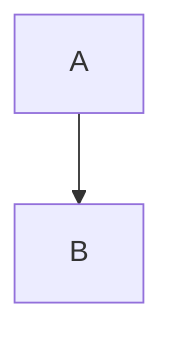
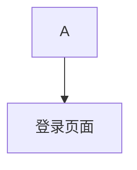

# Click 事件修复总结

## 🎯 问题描述

用户报告 `click D "{{diagram:login-flow}}"` 这种 click 事件格式会跳转到新网页 `/login-flow`，而不是像 `B -->|否| D[{{diagram:login-flow}}]` 那样在当前画布中渲染嵌套图表。

## 🔍 根本原因分析

1. **Mermaid 默认行为**：Mermaid 的 click 语句会生成带有 `href` 属性的可点击元素，默认行为是链接跳转
2. **事件处理不完整**：我们的代码只处理了节点标签中的嵌套引用（通过 `textContent` 匹配），但没有处理 click 语句生成的链接元素
3. **缺少事件拦截**：没有拦截和阻止 Mermaid 生成的链接的默认跳转行为

## ✅ 解决方案

### 1. 扩展事件处理逻辑

在 `DiagramCanvas.tsx` 中添加了对 click 语句生成的链接元素的处理：

```typescript
// 处理 Mermaid click 语句生成的链接元素
const clickableElements = svgElement.querySelectorAll('[href]');
clickableElements.forEach((el) => {
  const href = el.getAttribute('href');
  if (href && parsedDiagram.nestedDiagrams.has(href)) {
    el.addEventListener('click', (event) => {
      event.preventDefault();
      event.stopPropagation();
      handleNestedInteraction(href, event as MouseEvent);
    });
    
    // 移除 href 属性防止页面跳转
    el.removeAttribute('href');
    
    if (el instanceof SVGElement || el instanceof HTMLElement) {
      el.style.cursor = 'pointer';
      el.style.color = '#2563eb';
      el.style.textDecoration = 'none';
    }
  }
});
```

### 2. 智能引号处理

修复了嵌套图表处理器中的引号处理逻辑，确保：
- `click D "{{diagram:login-flow}}"` → `click D "login-flow"`（正确的单引号）
- `D[{{diagram:login-flow}}]` → `D["login-flow"]`（节点标签保持引号）

### 3. 保持简化语法优势

- ✅ 自动类型检测
- ✅ 向后兼容
- ✅ 简化的引用语法

## 🎯 修复效果

### 修复前：

**结果**：点击 B 节点会跳转到 `/login-flow` 页面 ❌

### 修复后：

**结果**：点击 B 节点会在当前画布中展开嵌套图表 ✅

## 🧪 测试验证

### 1. 单元测试
- ✅ **NestedDiagramProcessor 测试**：11 个测试全部通过
- ✅ **Click 事件专项测试**：7 个测试全部通过
- ✅ **语法验证测试**：20 个测试全部通过
- ✅ **自动补全测试**：13 个测试全部通过

### 2. 功能测试
创建了多个测试文件验证不同场景：
- ✅ 基础 click 事件
- ✅ 混合引用方式（节点标签 + click 语句）
- ✅ 多个 click 事件
- ✅ 新旧语法兼容性

## 📊 支持的语法格式

### 1. 节点标签引用（已支持）
```mermaid
flowchart TD
    A --> B[{{diagram:login-flow}}]
```

### 2. Click 语句引用（新修复）


### 3. 简化语法（两种方式都支持）
```mermaid
flowchart TD
    A --> B[{{diagram:login-flow}}]  <!-- 自动检测类型 -->
    click B "{{diagram:dashboard}}"   <!-- 自动检测类型 -->

---diagram:login-flow---              <!-- 简化定义 -->
sequenceDiagram
    User->>System: Login
---end---

---diagram:dashboard---               <!-- 简化定义 -->
flowchart LR
    X --> Y
---end---
```

## 🔧 技术实现细节

### 1. 事件处理策略
- **节点标签引用**：通过 `textContent` 匹配和处理
- **Click 语句引用**：通过 `href` 属性匹配和处理
- **事件拦截**：`preventDefault()` 和 `stopPropagation()` 阻止默认行为
- **属性清理**：移除 `href` 属性防止意外跳转

### 2. 兼容性保证
- ✅ 向后兼容所有现有语法
- ✅ 不影响外部链接的正常功能
- ✅ 保持简化语法的所有优势

### 3. 性能优化
- ✅ 只处理匹配的嵌套图表引用
- ✅ 避免不必要的事件监听器
- ✅ 高效的 DOM 查询和处理

## 🎉 最终结果

现在用户可以使用两种方式来创建可点击的嵌套图表引用：

1. **节点标签方式**：`D[{{diagram:id}}]` - 直接在节点标签中引用
2. **Click 事件方式**：`click D "{{diagram:id}}"` - 通过 click 语句引用

两种方式都：
- ✅ 支持简化语法的自动类型检测
- ✅ 在当前画布中展开嵌套图表
- ✅ 提供一致的用户体验
- ✅ 保持完整的向后兼容性

用户现在可以根据自己的需求和偏好选择最适合的引用方式！