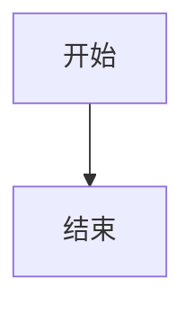

# SVG 显示测试

测试 SVG 是否能正常显示，以及 click 事件拦截是否正常工作。

## 测试用例1：基础 SVG 显示


## 测试用例2：带 click 事件的 SVG
```mermaid
flowchart TD
    A[开始] --> B[登录页面]
    B --> C[验证]
    
    click B "{{diagram:login-flow}}"

---diagram:login-flow---
sequenceDiagram
    participant U as 用户
    participant S as 系统
    U->>S: 输入用户名密码
    S-->>U: 验证结果
---end---
```

## 测试用例3：节点标签引用
```mermaid
flowchart TD
    A[开始] --> B[登录页面]
    B --> C[{{diagram:login-details}}]

---diagram:login-details---
sequenceDiagram
    participant U as 用户
    participant S as 系统
    U->>S: 登录详情
    S-->>U: 返回信息
---end---
```

## 预期行为

1. **基础 SVG**：应该正常显示流程图 ✅
2. **Click 事件 SVG**：应该显示图表，点击 B 节点应该展开嵌套图表，不应该跳转页面 ✅
3. **节点标签引用**：应该显示图表，点击 C 节点应该展开嵌套图表 ✅

## 修复内容

1. **移除了错误的 return 语句**：之前在 SVG 处理中添加的 return 语句导致 SVG 无法插入到 DOM
2. **正确的 MutationObserver 清理**：在每次渲染前清理之前的 observer
3. **保持所有拦截机制**：多层事件拦截、属性清理、全局拦截器等